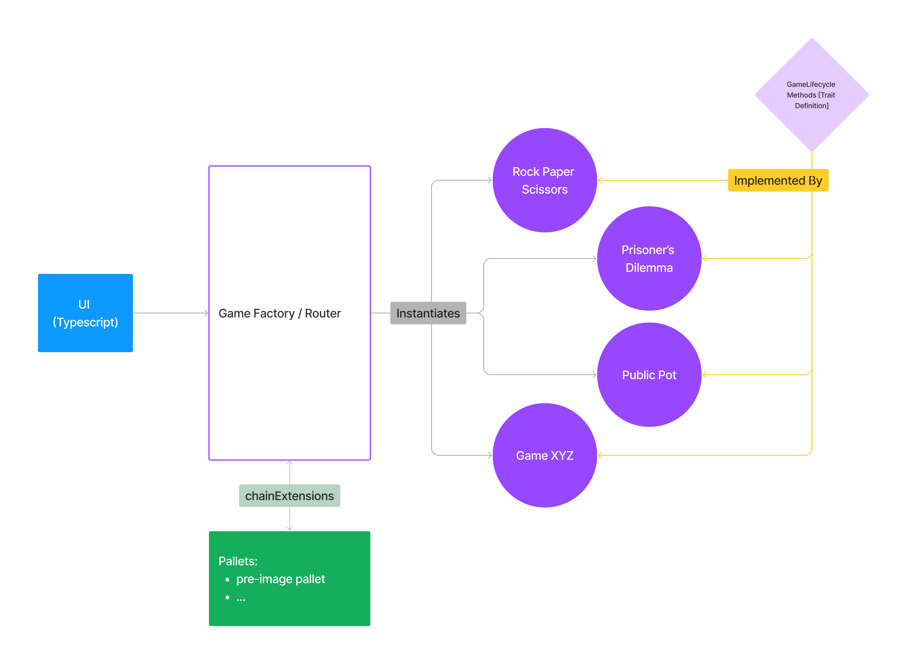
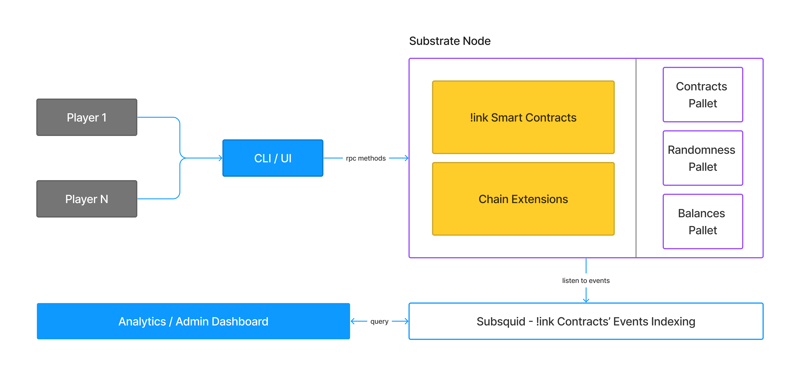
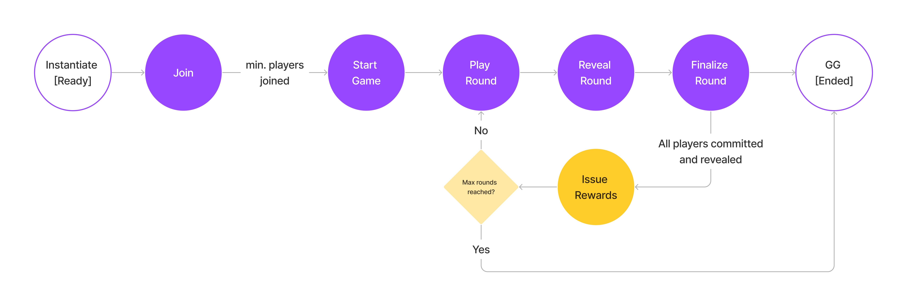

# Game Theory with ink!

An ink! tool for playing and researching games based on the field of "Game Theory" by using smart contracts.

This repo contains an implementation of some [games within the Game Theory field](https://en.wikipedia.org/wiki/List_of_games_in_game_theory). 

One example of games in the field of game-theory is called "Prisoner's Dilemma" and here's a [video from Youtube](https://www.youtube.com/watch?v=t9Lo2fgxWHw) 
explaining the game's logic.

### Current deployments on Shibuya Testnet
- `public good`: [WiSYijQ7QyTvpt27CuqyoyGgi6Z3okXeuEt9JeB9mjcAdgG](https://shibuya.subscan.io/account/WiSYijQ7QyTvpt27CuqyoyGgi6Z3okXeuEt9JeB9mjcAdgG)
- `rock paper scissors`: [XeYM2p1KSq9z3daXwfaw41ZKZLPbJGdaBdghsrfb3kPNMBm](https://shibuya.subscan.io/account/XeYM2p1KSq9z3daXwfaw41ZKZLPbJGdaBdghsrfb3kPNMBm)
- `dictator`: randomness extension not currently supported on Shibuya.

---

## Explanation & Demo Video

[](https://www.youtube.com/watch?v=7MqKyjXFkHQ)

> Only a couple of games are currently implemented, deployable (tested on Shibuya) and playable from the list linked above, however, the implementation
is done such that it follows a standardized set of traits (see `./logics/traits` directory) defined within the reusable (across contracts) code
such as type and trait definitions. More details in the [Project Components section](#architecture--components).
> 
> Taking such an approach means more games can be easily added to extend this project beyond the current hackathon submission.

---

## Motivation

Open-source software such as [oTree](https://www.otree.org/), a behavioural-research platform, is often used to create games
in order to simulate, with students or participants, stakes seen in real-life economics. 
Data from such simulations is then utilized in research papers or case-studies.

This motivates us to create a decentralized version of such a platform. The benefit of using blockchain for such a purpose is the following:

* **Transparency and Trust** of data quality and authenticity
* **High Availability**
* (potentially) Incentive-driven participation of players

Sources for economics research can vary and be equally valid. Could blockchain and lightweight yet economically motivated games
introduce a fun way to contribute to this goal?

Another motivation is the exploration of !ink smart contracts functionality for basic game dynamics development.

---

## Overview

### Logic Organization



### Architecture & Components



1. **Traits**: the `traits` crate defines the behaviours which every game must provide as well as common types.
   * There 3 `trait-defintion`s which specify the methods needed by each game. `Lifecycle` (game play methods),
     `Basic` (simple getters/setters) and `Admin` (admin-level methods). See [traits](./logics/traits) module.
   * Common types include `GameError`, `GameConfigs` and other relevant data types. See [types](./logics/traits/types.rs) module.

2. **Games**: the games are !ink smart contracts which implement a subset or all the traits mentioned above.
   * Each __instance__ of a game contract represents a single game play.
   * To play the game again, a new __instance__ must be launched.
   * The contract should terminate once the game is completed and the final round's winnings are issued.

3. [post hackathon] **Router**: the `games_router` create defines a generic contract which the UI will invoke when launching
   new games as well as when having high-level interactions with the games' contracts.
   * It does not contain game specific code.
   * It is extensible to allow future games to be added.

4. [post hackathon] **Typescript/React UI**
   a. Add event indexing and lookup
   b. Add Admin / Analytics dashboard
   c. Add ability to connect using a wallet (see [use-inkathon](https://github.com/scio-labs/use-inkathon))

### Game Lifecycle Flow



---

## Getting Started

> Note: please use the `nightly-2023-02-07` cargo toolchain channel. See [Cargo.toml](./Cargo.toml)

### Testing

Simply run `cargo test` to run tests of all the crates / packages.

To run a specific contract's tests, use the `-p` (or `--package`) flag, for example:

```shell
cargo test -p public_good
```

or 

```shell
cargo test -p rock_paper_scissors
```

or 

alternatively `cd` into that contract's directory and run `cargo test` within the package code.

### Building Contracts

Since this is a workspace, each contract currently needs to be built independently into WASM / ABI.

Use the following command to a build a contract:

```shell
cargo contract build --release --manifest-path contracts/SOME_CONTRACT_FOLDER/Cargo.toml
```

or this to build all of them:
```sh
sh build-all.sh
```

### Deploying Contracts

Contracts can be deployed on any Substrate chain which supports smart contract functionality via !ink, however, some games' contracts
require certain `chain-extensions` in order to operate correctly.

For example, the `Dictator` game requires a function which generates a random value. This functionality is available in the 
[Randomness Pallet](https://docs.rs/pallet-randomness-collective-flip/latest/pallet_randomness_collective_flip/) and can be made 
accessible by using the `chain-extensions` feature in !ink and add some relevant code in the Runtime to handle calls
from smart contracts.

> Note: The corresponding Runtime code which handles getting the random value from the pallet is added into a forked
> version of "Swanky Node". 
>
> See the [extension-specific code](https://github.com/subslice/swanky-node/blob/4902e49d19d0581f9a79f1d30fb0e1a4e40b8b29/runtime/src/chain_extensions.rs)
> added to the [forked Swanky Node Repo](https://github.com/subslice/swanky-node) for reference.

---

## Next Steps

- [ ] Create UI for Game Theory experiments: https://github.com/subslice/game-theory/issues/44
- [ ] Use shared events: https://github.com/subslice/game-theory/issues/33
- [ ] Move completely to OpenBrush
- [ ] Enable Upgradeability: https://github.com/subslice/game-theory/issues/34
- [ ] Use Mappings instead of Vector of Tuple: https://github.com/subslice/game-theory/issues/10

---

## Contributors

- [Faisal A.](https://github.com/FaisalAl-Tameemi)
- [Arthur F. M.](https://github.com/a-moreira)

