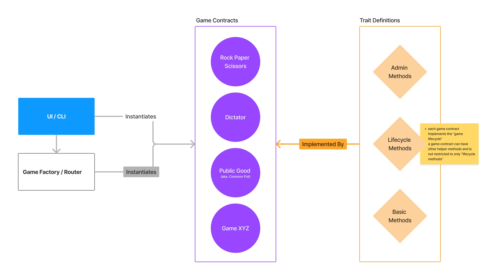

# Game Theory with ink!

> Submission for the Encode x Polkadot Hackathon 2023

---

## Overview

### Packages

The project contains a few components that together compose the overall experience.

1. Traits: the `traits` crate defines the behaviours which every game must provide and common types.
    * The `trait-defintion` of `Lifecycle` specifies the methods which must be implemented by each game.
    * Common types include `Error`, `GameStatus`, `RoundStatus`, `GameRound` and `GameConfigs`.

2. Router: the `router` create defines a generic contract which the UI will invoke when launching new games as well as when having high-level interactions with the games' contracts.
    * It does not contain game specific code.
    * It is extensible to allow future games to be added.

3. Games: the games themselves are example contract implementations (`rock_paper_scissors` and `public_good`) of the `Lifecycle` trait.
    * Each __instance__ of a game contract represents a single game play.
    * To play the game again, a new __instance__ must be launched.
    * The contract should self-destruct once the game is completed and final round's winnings are issued.


### General Notes

Because the Router is agnostic to the exact games, other games which follow the `Lifecycle` trait can be implemented, launched on-chain and added to the Router to be used publicly.

There is also no absolute need for the router other than making the instantiation of games easier as well as some future generic behaviour which simplifies contract interaction.

> This is a design choice. Chain-extensions can either be implemented in the games' contracts or in the router if the behaviour is generic.
> 
> For example: Playing a round requires that the submission is committed (hashed) and later revealed. This can either be done by the Router or directly with the game. The applies to things such as rewards distributions.


### Architecture Diagram




---

## Getting Started

### Testing

Simply run `cargo test` to run tests of all the crates / packages.

To run a specific contract's tests, use the `-p` flag, for example:

```shell
cargo +nightly test -p public_good
```

or `cd` into that contract's directory and run `cargo test` within.


### Building Contracts

Since this is a workspace, each contract currently needs to be built independantly into WASM / ABI.

Use the following command to a build a contract:

```shell
cargo contract build --release --manifest-path contracts/SOME_CONTRACT_FOLDER/Cargo.toml
```
